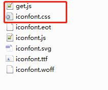
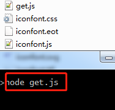
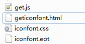

# iconfontcss2html
Convert iconfont.css to html.由于项目中可能会引入多个iconfont，但是又不清楚其他的文件中包含的图标，故转换iconfont.css成html页面，展示其中的图标

# 环境
node

# 使用方式
将get.js放在iconfont.css同级目录下面，在当前目录下运行node get.js,会得到geticonfont.html，然后在浏览器打开这个文件即可。

注：方法来源于网络，忘记是哪里了，抱歉
